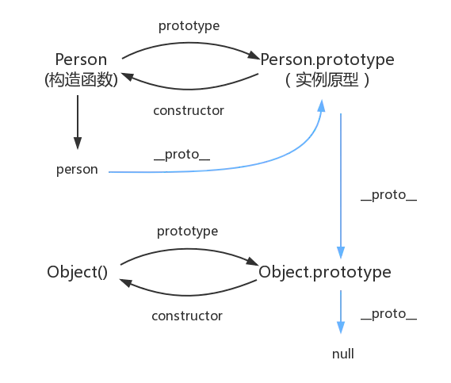

### 前言
这篇文章，我在简书上写了一天，然后简书那边出故障了，全没了。联系了工作人员，得到以下忽悠，此刻我只想说声谢（he）谢（he）。于是决心以后把笔记都搬到github了。


### 创建对象

***工厂方法***

优点：可创建多个相似对象

缺点：不能标识创建的对象，是来自哪里的（谁创建的）

```js
function createPerson(name, age, job) {
    let o = new Object();
    o.name = name;
    o.age = age;
    o.job = job;
    o.sayName = function () {
        console.log(this.name);
    };
    return o;
}
let person1 = createPerson("Nicholas", 29, "Software Engineer");
let person2 = createPerson("Greg", 27, "Doctor");
```

***构造函数***
优点：能够标识创建的对象，通过person1 instanceof Person方法 或者 person1.constructor == Person

缺点：每次创建实例，不能共享方法，也就是需要每次都要新建同样的方法

```js
function Person(name, age, job) {
    this.name = name;
    this.age = age;
    this.job = job;
    this.sayName = function () {
        console.log(this.name);
    };
}
let person1 = new Person("Nicholas", 29, "Software Engineer");
let person2 = new Person("Greg", 27, "Doctor");
}
```

***原型方法***

优点：可以共享方法

缺点：省略了传参，导致了共享属性，当需要操作一些引用类型的数据的时候会出问题

```javascript
//**ES5版本**
function Person() {}
Person.prototype.name = "Nicholas";
Person.prototype.age = 29;
Person.prototype.job = "Software Engineer";
Person.prototype.obj = {}; // <----------- 引用类型
Person.prototype.sayName = function () {
    console.log(this.name);
};
let person1 = new Person();
person1.sayName(); //"Nicholas"
let person2 = new Person();
person2.sayName(); //"Nicholas"
console.log(person1.sayName === person2.sayName); //true
console.log(person1.age === person2.age); //true
console.log(person1.obj === person2.obj); //true <----- 这里会出问题

//**ES6版本**
class Person {
    constructor(name, age, job) {
        this.name = name;
        this.age = age;
        this.job = job;
    }
    sayName () {
        console.log(this.name); // this指向实例
    };
    /*
        注意，这里的效果等同于
        Person.prototype.sayName = function() {}
        声明的方法，是基于prototype上的
    */
    static bar() { // 静态方法
        this.baz(); // this指向构造函数/类
    }
    static baz() {
        console.log('hello');
    }
}

Person.bar() // 调用静态方法
let person1 = new Person(1,2,3)
person1.bar() // 不能调用静态方法
```

### 原型链




1. 构造函数的prototype属性，存的是一个指针，指向原型对象
2. 原型对象的constructor属性，存的是一个指针，指向构造函数
3. 实例的__proto__属性，存的是一个指针，指向原型对象
4. 实例的constructor属性，存的是一个指针，指向构造函数
5. 原型对象本身也是一个对象实例，所以它也有__proto__属性，指向Object的原型对象Object.prototype
6. Object.prototype的constructor指向Object
7. Object的prototype指向Object.prototype

注意，在生产环境，尽量不要用__proto__，取而代之的用Object.getPrototypeOf()

（es6新增）

子class的__proto__指向父class，表示构造函数的继承

子class的prototype，它的__proto__指向父class的prototype，表示方法的继承

### new的实现过程
- new操作是实例化一个构造函数，想一想一个实例，他有什么属性？
  1. 有构造函数的属性和方法
  2. __proto__指向构造函数的原型对象
  3. 返回一个对象
- new操作做了什么：
  1. 新建一个对象
  2. 将对象的__proto__指向构造函数的原型对象
  3. 调用构造函数，this指向步骤1新建的对象，实例化对应的属性和方法
  4. 如果执行构造函数，返回的不是对象类型，则返回步骤1新建的对象；如果返回的是对象类型，则返回这个对象

```javascript
// mock new
function objectFactory() {
    // 新建一个对象
    let obj = new Object();
    // arguments不是一个真数组，所以用[].shift.call来调用，argument作为this传进去，执行shift操作，得到构造函数，并且argument删除第一个元素
    let Constructor = [].shift.call(arguments);
    // 将对象的__proto__指向构造函数的原型对象
    obj.__proto = Constructor.prototype;
    // 调用构造函数，this指向新建的对象obj，实例化对应的属性和方法
    let ret = Constructor.apply(obj, arguments)
    // 如果执行构造函数，返回的不是对象类型，则返回obj；如果返回的是对象类型，则返回这个对象
    return typeof ret === 'object' ? ret : obj
}

function Otaku (name, age) {
    this.name = name;
    this.age = age;
    this.habit = 'Games';
}

let person = objectFactory(Otaku, 'Kevin', '18')
```

### 继承
**ES5版本**
```js
function SuperType(name) {
    this.name = name;
    this.colors = ["red", "blue", "green"];
}
SuperType.prototype.sayName = function () {
    // 这里的this指向实例
    console.log(this.name);
};

function SubType(name, age) {
    //继承属性
    SuperType.call(this, name);
    this.age = age;
}
//继承方法
SubType.prototype = new SuperType();  // 虽然prototype上有name属性，但是因为先访问实例属性，所以可以不理会
SubType.prototype.constructor = SubType;

SubType.prototype.sayAge = function () {
    console.log(this.age);
};
let instance1 = new SubType("Nicholas", 29);
instance1.colors.push("black");
console.log(instance1.colors); //"red,blue,green"
instance1.sayName(); //"Nicholas";
instance1.sayAge(); //29
let instance2 = new SubType("Greg", 27);
console.log(instance2.colors); //"red,blue,green"
instance2.sayName(); //"Greg";
instance2.sayAge(); //27
```


**ES6版本**
```javascript
class Father {
    constructor(name, age) {
        this.age = age
        this.name = name
    }
    static personality () {
        console.log('I am such a dick, I wish my son isn\'t');
    }
    eating () {
        console.log('eating')
    }
}

class Child extends Father {
    constructor(name, age) {
        super(name, age)
        this.script = 'escape from the orginial family'
    }
    swimming () {
        console.log('swimming')
    }
}
```

1. ES6新增：子类__proto__指向父类
2. 子类.prototype.__proto__指向父类.prototype
### 边角知识

**重写原型对象**

```js
function Person() {}
    Person.prototype.name = "Nicholas";
    Person.prototype.age = 29;
    Person.prototype.job = "Software Engineer";
    Person.prototype.sayName = function () {
    console.log(this.name);
};
```
vs
```js
function Person() {}
Person.prototype = {
    constructor: Person,
    name: "Nicholas",
    age: 29,
    job: "Software Engineer",
    sayName: function () {
        console.log(this.name);
    }
};
```


效果是一样的，可以用instanceof来判断关系。

区别：后者是完全重写了一个对象，所以要自己添加constructor属性，而且该[[Enumerable]]属性变成了true，要改为false

**动态性**

```js
let friend = new Person();
Person.prototype.sayHi = function () {
    console.log("hi");
};
friend.sayHi(); //"hi"（没有问题！）
```

原理：因为__proto__是一个指针

***结合构造函数&原型方法的优点***

```js
function Person(name, age, job) {
    this.name = name;
    this.age = age;
    this.job = job;
    this.friends = ["Shelby", "Court"];
}
Person.prototype = {
    constructor: Person,
    sayName: function () {
        console.log(this.name);
    }
}
let person1 = new Person("Nicholas", 29, "Software Engineer");
let person2 = new Person("Greg", 27, "Doctor");
person1.friends.push("Van");
console.log(person1.friends); //"Shelby,Count,Van"
console.log(person2.friends); //"Shelby,Count"
console.log(person1.friends === person2.friends); //false
console.log(person1.sayName === person2.sayName); //true
```

### ES6 Class的一些方法
1. new.target

---

### Reference
- 《JavaScript高级程序设计》
- https://es6.ruanyifeng.com/
- https://github.com/mqyqingfeng/Blog/issues/13
