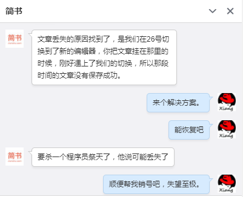
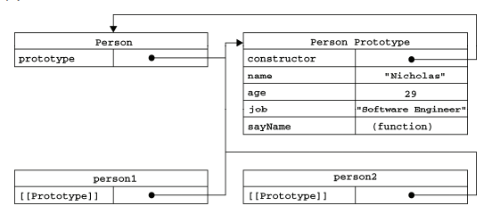
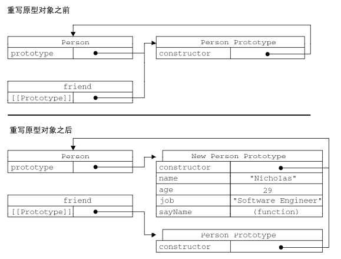
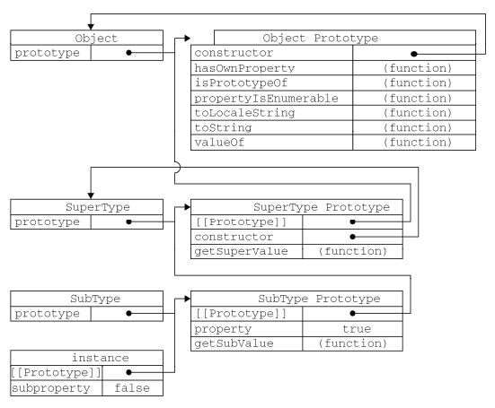

### 前言
这篇文章，我在简书上写了一天，然后简书那边出故障了，全没了。联系了工作人员，得到以下忽悠，此刻我只想说声谢（he）谢（he）。于是决心以后把笔记都搬到github了。



### 知识架构
[点击查看脑图](http://naotu.baidu.com/file/ae7e68824c3db245ce0236f466481eac?token=9125b02f9ef2b128)

### 创建对象

***工厂方法***

优点：可创建多个相似对象

缺点：不能标识创建的对象，是来自哪里的（谁创建的）

```js
function createPerson(name, age, job) {
    var o = new Object();
    o.name = name;
    o.age = age;
    o.job = job;
    o.sayName = function () {
        alert(this.name);
    };
    return o;
}
var person1 = createPerson("Nicholas", 29, "Software Engineer");
var person2 = createPerson("Greg", 27, "Doctor");
```

***构造函数***

优点：能够标识创建的对象，通过person1 instanceof Person方法 或者 person1.constructor == Person

缺点：每次创建实例，不能共享方法，也就是需要每次都要新建同样的方法

```js
function Person(name, age, job) {
    this.name = name;
    this.age = age;
    this.job = job;
    this.sayName = function () {
        alert(this.name);
    };
}
var person1 = new Person("Nicholas", 29, "Software Engineer");
var person2 = new Person("Greg", 27, "Doctor");
```

***原型方法***

优点：可以共享方法

缺点：省略了传参，导致了共享属性，当需要操作一些引用类型的数据的时候会出问题

```js
function Person() {}
Person.prototype.name = "Nicholas";
Person.prototype.age = 29;
Person.prototype.job = "Software Engineer";
Person.prototype.sayName = function () {
    alert(this.name);
};
var person1 = new Person();
person1.sayName(); //"Nicholas"
var person2 = new Person();
person2.sayName(); //"Nicholas"
alert(person1.sayName == person2.sayName); //true
```

**原型链**



构造函数的prototype属性，存的是一个指针，指向原型对象；

原型对象的constructor属性，存的是一个指针，指向构造函数，它本身也是一个对象实例，所以也有\_\_proto\_\_属性，指向Object.prototype；

实例的constructor属性指向构造函数，\_\_proto\_\_指向原型对象；

注意，在生产环境，尽量不要用\_\_proto\_\_，取而代之的用Object.getPrototypeOf()

（es6新增）

子class的\_\_proto\_\_指向父class，表示构造函数的继承

子class的prototype，它的\_\_proto\_\_指向父class的prototype，表示方法的继承

**重写原型对象**

```js
function Person() {}
Person.prototype.name = "Nicholas";
Person.prototype.age = 29;
Person.prototype.job = "Software Engineer";
Person.prototype.sayName = function () {
    alert(this.name);
};
```
vs
```js
function Person() {}
Person.prototype = {
    constructor: Person,
    name: "Nicholas",
    age: 29,
    job: "Software Engineer",
    sayName: function () {
        alert(this.name);
    }
};
```



效果是一样的，可以用instanceof来判断关系。

区别：后者是完全重写了一个对象，所以要自己添加constructor属性，而且该[[Enumerable]]属性变成了true，要改为false


**动态性**

```js
var friend = new Person();
Person.prototype.sayHi = function () {
    alert("hi");
};
friend.sayHi(); //"hi"（没有问题！）
```

原理：因为\_\_proto\_\_是一个指针

***结合构造函数&原型方法的优点***

```js
function Person(name, age, job) {
    this.name = name;
    this.age = age;
    this.job = job;
    this.friends = ["Shelby", "Court"];
}
Person.prototype = {
    constructor: Person,
    sayName: function () {
        alert(this.name);
    }
}
var person1 = new Person("Nicholas", 29, "Software Engineer");
var person2 = new Person("Greg", 27, "Doctor");
person1.friends.push("Van");
alert(person1.friends); //"Shelby,Count,Van"
alert(person2.friends); //"Shelby,Count"
alert(person1.friends === person2.friends); //false
alert(person1.sayName === person2.sayName); //true
```

### 继承

```js
function SuperType(name) {
    this.name = name;
    this.colors = ["red", "blue", "green"];
}
SuperType.prototype.sayName = function () {
    // 这里的this指向实例
    alert(this.name);
};

function SubType(name, age) {
        //继承属性
        SuperType.call(this, name);
        this.age = age;
    }
//继承方法
SubType.prototype = new SuperType();  // 虽然prototype上有name属性，但是因为先访问实例属性，所以可以不理会
SubType.prototype.constructor = SubType;

SubType.prototype.sayAge = function () {
    alert(this.age);
};
var instance1 = new SubType("Nicholas", 29);
instance1.colors.push("black");
alert(instance1.colors); //"red,blue,green,black"
instance1.sayName(); //"Nicholas";
instance1.sayAge(); //29
var instance2 = new SubType("Greg", 27);
alert(instance2.colors); //"red,blue,green"
instance2.sayName(); //"Greg";
instance2.sayAge(); //27
```



### ES6

---

### Reference
《JavaScript高级程序设计》