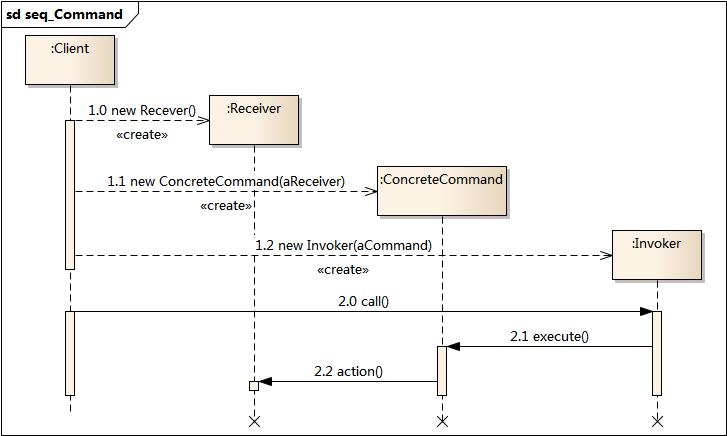

### 定义

封装 方法的调用

### 场景

对象 A 调用对象 B 的方法，如果需要做一些调整（如参数的调整、调整方法的调用顺序），或者中间处理（日志记录、队列、undo……）

### 设计原则

LKP：引入 Command 对象，作为处理的中介
open-close：在 Command 对象，做一些中间处理，而非改变 Receiver 或者 Invoker

### 模式

操作流：Invoker --> Command --> Receiver

#### 模式-角色

Invoker：可以与 Client 融为一体，操作 Command

Command：

1. 分为 简单命令对象、复杂命令对象、灰色地带命令对象 三种，见[demo](./command-demo-06.js)
1. 接口统一化，被同等对待，可以随意互换

Receiver：可以没有 Recevier，在 Command 中做操作

### 优点

1. 松散耦合：引入了 Command 对象，不影响 Recevier、Invoker 下，做调用方法的中间处理
1. 动态控制
1. 扩展性强

### 缺点

引入了 Command 对象，如果是本来简单的调用，而为了模式角色的完整而加入，反而让程序变复杂

### 扩展

FIXME:

**Command 模式 + Composite 模式**：
[宏命令](./command-demo-10.js)

**Command 模式 + Decorate 模式**：
[undo_demo](./command-demo-08.js)

**Command 模式 + Memento 模式**:

**Command 模式 + TemplateMethod 模式**...