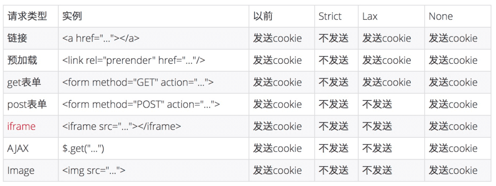

### Samesite

1. 同站（samesite），是指顶级域名+二级域名相同，例如baidu.com，只要这两个相同就是samesite
2. 同站的cookie叫做第一方cookie，否则叫第三方cookie
3. 同站跟同源/同域不是同一个概念，同源的限制比较大，需要协议、主机号、端口都一样

4. ```samesite=strict```，同站的cookie才会发过去
5. ```samesite=lex```，除了```a```、```link[ref=prerender]```、```form的get方法```可以带第三方cookie，其他只能带第一方cookie
6. ```samesite=none```既可以带第一方cookie，又可以带第三方cookie。但需要注意：
   1. 结合cookie的secure属性使用，只能在https下启用
   2. ios12的safari、旧版本的Chrome，会把```samesite=none```当成```samesite=strict```，所以后端在setCookie之前要判断UA（[UA列表](https://www.chromium.org/updates/same-site/incompatible-clients)）
7. 第三方cookie的应用
   1. CSRF攻击
   2. 在其他网站投放本站的广告，基于cookie获取本站的用户信息，进而更精准地做推送 


### Reference
1. https://www.chromium.org/administrators/policy-list-3/cookie-legacy-samesite-policies
2. https://github.com/mqyqingfeng/Blog/issues/157
3. https://medium.com/@azure820529/chrome-80-%E5%BE%8C%E9%87%9D%E5%B0%8D%E7%AC%AC%E4%B8%89%E6%96%B9-cookie-%E7%9A%84%E8%A6%8F%E5%89%87%E8%AA%BF%E6%95%B4-default-samesite-lax-aaba0bc785a3