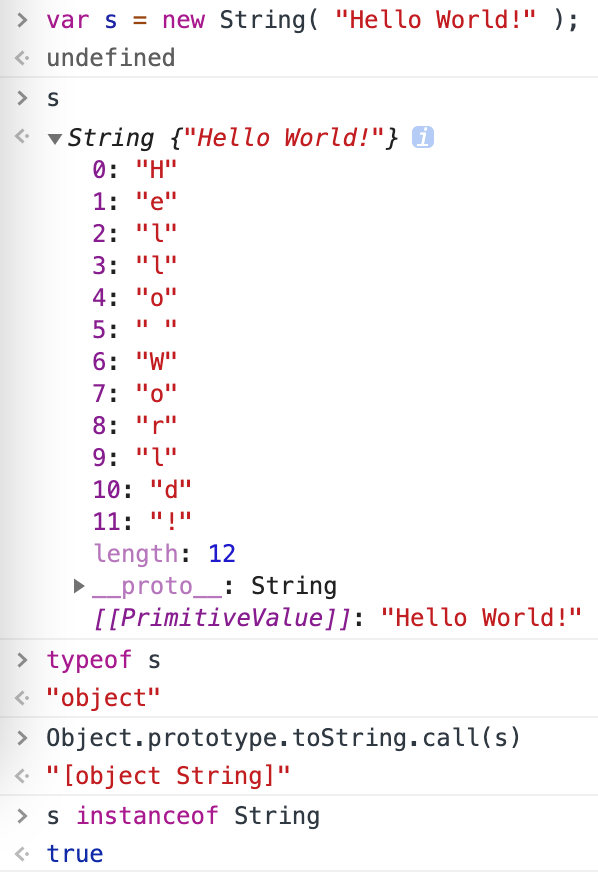

这是最常用的原生类型的内建函数一览：

String()
Number()
Boolean()
Array()
Object()
Function()
RegExp()
Date()
Error()
Symbol() —— 在 ES6 中被加入的！



重点是，new String("abc") 为 "abc" 创建了一个字符串```包装器对象```，而不仅是基本类型值 "abc" 本身。

重要的是，typeof 显示这些对象不是它们自己的特殊 类型，而是 object 类型的子类型。

```内部 [[Class]]```
1. typeof 的结果为 "object" 的值（比如数组）被额外地打上了一个内部的标签属性 [[Class]]
```javascript
Object.prototype.toString.call( [1,2,3] );			// "[object Array]"

Object.prototype.toString.call( /regex-literal/i );	// "[object RegExp]"
```
2. 这个属性不能直接地被访问，但通常可以间接地通过在这个值上借用默认的 Object.prototype.toString(..) 方法调用来展示
3. 在大多数情况下，这个内部的 [[Class]] 值对应于关联这个值的内建的原生类型构造器。你会注意到，不存在 Null() 和 Undefined() 原生类型构造器，但不管怎样 "Null" 和 "Undefined" 是被暴露出来的内部 [[Class]] 值。
4. 对于像 string、number、和 boolean 这样的简单基本类型，都自动地被它们分别对应的对象```包装器封箱```，这就是为什么 "String"、"Number"、和 "Boolean" 分别被显示为内部 [[Class]] 值。

```封箱包装器```
1. 这些对象包装器服务于一个非常重要的目的。基本类型值没有属性或方法，所以为了访问 .length 或 .toString() 你需要这个值的对象包装器。值得庆幸的是，JS 将会自动地 封箱（也就是包装）基本类型值来满足这样的访问。
2. 坑：new Boolean(false) 结果是truly，因为结果是一个对象

```开箱```
1. 如果你有一个包装器对象，而你想要取出底层的基本类型值，你可以使用 valueOf() 方法：
```javascript
var a = new String( "abc" );
var b = new Number( 42 );
var c = new Boolean( true );

a.valueOf(); // "abc"
b.valueOf(); // 42
c.valueOf(); // true
```
2. 当以一种查询基本类型值的方式使用对象包装器时，开箱也会隐含地发生。这个处理的过程是（强制转换）
```javascript
var a = new String( "abc" );
var b = a + ""; // `b` 拥有开箱后的基本类型值"abc"

typeof a; // "object"
typeof b; // "string"
```

```原生类型作为构造器```
1. 对于 array、object、function 和正则表达式值来说，使用字面形式来创建它们的值几乎总是更好的选择，而且字面形式与构造器形式所创建的值是同一种对象（也就是，没有非包装的值）。

``` Array ```
1. 坑：new Array(3)会产生空槽值，形式是[ undefined x 3 ]，map方法会报错，而join会生效
2. 正常的空槽值，应该是[undefined, undefined, undefined]，可以通过Array.apply( null, { length: 3 } )创建，或者手动创建
   
``` Object ```
1. 几乎没有理由使用 new Object() 构造器形式，尤其因为它强迫你一个一个地添加属性，而不是像对象的字面形式那样一次添加许多。

``` Function ```
1. Function 构造器仅在最最罕见的情况下有用，也就是你需要动态地定义一个函数的参数和/或它的函数体。不要将 Function(..) 仅仅作为另一种形式的 eval(..)。你几乎永远不会需要用这种方式动态定义一个函数。

``` RegExp ```
1. 用字面量形式（/^a*b+/g）定义正则表达式是被大力采用的，不仅因为语法简单，而且还有性能的原因 —— JS 引擎会在代码执行前预编译并缓存它们。
2. 和我们迄今看到的其他构造器形式不同，RegExp(..) 有一些合理的用途：用来动态定义一个正则表达式的范例。
```javascript
var name = "Kyle";
var namePattern = new RegExp( "\\b(?:" + name + ")+\\b", "ig" );

var matches = someText.match( namePattern );
```

```Date```
1. Date(..) 和 Error(..) 原生类型构造器要比其他种类的原生类型有用得多，因为它们没有字面量形式。
2. new Date()).getTime() === Date.now()
3. 注意： 如果你不带 new 调用 Date()，你将会得到一个那个时刻的日期/时间的字符串表达。在语言规范中没有规定这个表达的确切形式，虽然各个浏览器趋向于赞同使用这样的东西："Fri Jul 18 2014 00:31:02 GMT-0500 (CDT)"。

```Error```
1. 它会将当前的执行栈上下文捕捉进对象中（在大多数 JS 引擎中，在创建后使用只读的 .stack 属性表示）。这个栈上下文包含函数调用栈和 error 对象被创建时的行号，这使调试这个错误更简单。
2. Error对象实例，常用的属性：message、stack、type

```Symbol```
1. 它不允许你将 new 与它一起使用，这么做会抛出一个错误。
2. 它们的主要用途可能是私有属性，或者类似的特殊属性
3. Symbol 不是 object，它们是简单的基本标量。

```原生类型原型```
1. 每一个内建的原生构造器都拥有它自己的 .prototype 对象 —— Array.prototype，String.prototype 等等。例如，所有的字符串对象，和 string 基本值的扩展（通过封箱），都可以访问在 String.prototype 对象上做为方法定义的默认行为。
2. Function.prototype 是一个函数，RegExp.prototype 是一个正则表达式，而 Array.prototype 是一个数组。