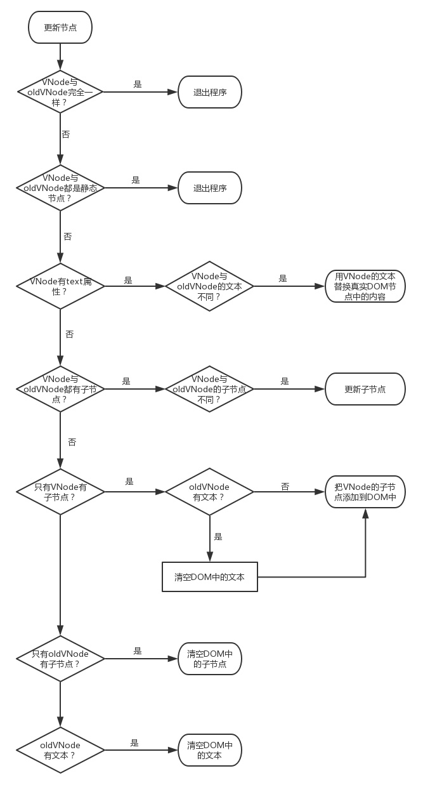

1. 为什么选择
<!--
 * @description: 
 * @author: xiangrong.liu
 * @Date: 2021-05-17 11:07:53
 * @LastEditors: xiangrong.liu
 * @LastEditTime: 2021-05-18 10:26:38
-->
### 为什么需要vue
mvvm

数据驱动视图 UI=render(data) 

### vue有什么功能，关键功能是什么
mvvm
vdom
data/computed/watch/method
生命周期
组件化
组件间通讯

### vue的原理是什么，关键实现是如何实现的
mvvm
vdom-diff算法

### vue与react对比，有什么不同


### vue的优点和缺点，trade-off


---
### 相关面试题

**vue如何实现mvvm**

**vue构建原理，如何设计的**

**Loaders**
1. 有什么作用
2. 有哪些常用的loaders，有什么作用
3. loaders的加载顺序是怎样的，如何保证加载顺序？
4. 如何编写loaders

**Plugins**
1. 有什么作用
2. 有哪些常用的plugins，有什么作用
3. 如何编写plugins

**优化前端性能**
1. 代码压缩
   1. sourcemap
   2. 
2. 按需加载
3. tree-shaking
4. scope-hoisting

**优化构建速度**

**开发服务器**
1. 如何监听文件的变化
2. 如何实现热更新
3. 

**输入**
1. 如何配置单页应用、多页应用

**输出**
1. hash有什么作用，怎么分类


### Reference
1. https://juejin.cn/post/6844904094281236487
2. https://zhuanlan.zhihu.com/p/44438844


源码

1. 响应式
2. 响应式和更新
3. 虚拟dom与diff算法
4. watch/computed
5. 生命周期
6. 组件与webcomponent


vue采用了mvvm的思想，专注于view层，但不是mvvm框架。采纳了mvvm的思想：更新view，映射到model的变化；model的变化映射到view上，不需要用户再写逻辑去关联。专注于view层，加了虚拟dom、diff、组件

# 1.谈谈你对MVVM的理解？
mvvm是一个模式，把代码区分为数据、视图、viewModel。视图和数据的通讯由vm自动完成。当数据更新的时候，自动更新视图；当视图更新的时候会自动更新数据；实现双向绑定。但Vue本身不是一个mvvm框架，它只关注view层，为此实现了组件化、虚拟dom+diff算法等功能，也有实现数据劫持功能，以实现双向绑定。

# 2.请说一下Vue2及Vue3响应式数据的理解
响应式数据，就是数据改变，自动更新视图。
Vue2初始化的时候会执行render函数，触发了definedReative函数，其核心是Object.definedProperty，getter进行收集依赖，在收集依赖之前还会判断是否已经收集过了。当数据改变的时候，会触发setter进行发布更新，对比vdom，打补丁，更新试图。其中收集依赖和发布更新用到了观察者模式。
definedproperty的缺点是对对象、数组的劫持不彻底：对象的新属性不会自动劫持，需要手动调用$set方法，同理删除的时候需要$delete。数组需要逐个元素去检测，如果是对象则进行对象劫持，效率低，当数据量大的时候影响性能。
Vue3的用Proxy来代替使用.Proxy可以从底层支持对数组、对象修改的监控


definedproperty
get收集依赖:array object分别如何
set通知：array如何监听修改

收集依赖其实就是在Dep中添加wathcher.

初始化$mount-->new Watcher(mountComponent)-->get()-->添加依赖-->mounteComponent作为依赖，做了一个绑定。当改动的时候，直接调用对应的mountComponent方法

# 3.Vue中如何检测数组变化?
对push、pop、unshift、shift、splice、concat进行重写。调用原来的方法之后，对指定的元素进行判断，如果是对象的话进行劫持，如果是数组的话就递归处理。

# 4.Vue中如何进行依赖收集？
初始化的时候，template编译成render的时候对模板中的变量进行收集依赖，放到在object.definedproperty的getter中

# 5.如何理解Vue中模板编译原理
template --> 正则匹配标签属性变量 -> render函数

# 6.Vue生命周期钩子是如何实现的
本质上就是回调函数。vue在软件不同的

# 7.Vue的生命周期方法有哪些？一般在哪一步发送请求及原因
整合选项，初始化Vue
beforeCreated()
数据劫持，初始化data、method、computed、watch
created()
模板编译
beforeMounted()
视图挂载
mounted()
数据改动
beforeUpdate()
vdom diff & patch & render
updated()

调用this.$destory
beforeDestory()
tear down watch data event等
destory()


# 8.Vue.mixin的使用场景和原理
公用逻辑代码，原理就是合并对象，这里涉及到覆盖和冲突，优先级

# 9.Vue组件data为什么必须是个函数？
因为组件可能会被多次实例化，如果data直接返回对象，则这几个组件实例都共用同一个对象。不能做到隔离。


# 10.nextTick在哪里使用？原理是?
用在等待渲染完之后执行对应的逻辑，一般是在mounted钩子
nextTick的原理是异步操作。setImmdiate0 setTimout0 ...
js引擎的执行逻辑：同步、渲染、异步队列？？？

TODO: eventloop

# 11.computed和watch区别
computed是有缓存的，当变量有变化的时候，才会重新计算
watch，每次都会执行

# 12.Vue.set方法是如何实现的
就是Object.definedProperty，可能需要考虑层级的问题

# 13.Vue为什么需要虚拟DOM

WHY-HOW(with WHAT)，降维构建给对方听，from where to where

频繁的dom操作、整颗dom树重新渲染会导致渲染性能降低，渲染效果差。如果我们将js对象模拟dom节点，初始化渲染的时候我们得到一个vNode，在数据更新之后模板编程成新的vNode。我们把这两个vNode做对比，当大量的dom操作会导致渲染出的效果出问题，或者渲染慢。为了解决这个问题，用js的VNode对象模拟节点，数据改变之后，模板生成了新的VNode，旧VNode和新VNode对比，把要修改的进行修改，而不用一次性更新整颗dom树，大大降低性能损耗。

<!-- https://vue-js.com/learn-vue/virtualDOM/#_3-vue%E4%B8%AD%E7%9A%84%E8%99%9A%E6%8B%9Fdom -->
vNode模拟以下节点：元素节点、文本节点、注释节点、组件节点、函数组件节点、克隆节点

```html
元素节点：<div></div>
文本节点：123
静态节点：<div>123</div>（第一次渲染之后，后面的渲染不会改变，所以是静态节点）

```

# 14.Vue中diff算法原理
diff算法核心就是patch函数，对oldVNode和vNode一层一层对比，基于oldVNode做新增、删除、更新操作

1. 如果没有oldVNode，则针对VNode创建元素并挂载
2. 如果是oldVNode和VNode是相同节点（一样的标签，一样的key，一个的数据），则进行更新节点patchVNode


更新节点操作，无非是以下几种操作：
1. 如果节点不同，根据情况添加节点、删除节点
2. 更新节点：如果vNode没有文本节点，且oldVNode和vNode都有字节点，则进行更新子节点

更新子节点，在oldChildren和children两两比较，无非有以下几种可能：（基于oldChildren）
1. 删除节点
2. 更新节点（同patchVnode）
3. 添加节点（注意需要添加到未处理的节点之前，否则会影响后续的添加）
4. 移动节点（跟添加节点同理，需要移动到未处理的节点之前）

oldChildren和children两两对比算法优化：
1. 暴力两层for循环，对比节点。时间复杂度0(n^2)。源码虽然用了map来描述oldChildren，但是都逃不过每个oldChilren元素单独for循环children来对比，所以还是会导致时间复杂度0(n^2)
2. 两个children有两个头和尾的指针，从两边向中间靠拢迭代：oldChildren和children都有头尾两个指针oldStartIdx、oldEndIdx、newStartIdx、newEndIdx。先osi和nsi对比，如果节点相同，则进行patchVNode更新，否则对比osi和nei对比，如果节点相同，则进行移动节点并更新节点，否则对比oei和nei对比，如果节点相同，则更新节点，否则对比oei和nsi对比，如果节点相同，则进行移动节点并更新节点，否则用方法1暴力破解（注意这里只有nsi++）。当osi>oei，children剩下的节点就需要新增；当nsi>sei，oldChildren剩下的节点就需要删除

在迭代的过程，我们移动元素，会影响处理。那么diff算法是如果做到移动节点的时候不影响呢？其实删除节点、更新节点、添加接点、移动节点，都是调用dom api的，所以不会导致

最理想的情况下，全部都走优化的算法，则O(n)，最不理想的情况下爱，都走暴力算法，则O(n^2)，所以diff的时间复杂度为O(nlog^n)

diff 算法是一种通过同层的树节点进行比较的高效算法，避免了对树进行逐层搜索遍历，所以时间复杂度只有 O(n)。


# 15.既然Vue通过数据劫持可以精准探测数据变化，为什么还需要虚拟DOM进行diff检测差异
把更新dom的操作合并，一次更新，避免频繁更新dom

# 16.请说明Vue中key的作用和原理，谈谈你对它的理解
一般会用在v-for，在渲染的时候，diff会根据key来判断节点是否能复用

# 17.谈一谈对Vue组件化的理解
关注点分离，代码更好管理

# 18.Vue的组件渲染流程
create-component.js验证组件名是否合法-->拿到继承自Vue的组件构造函数-->变成了component: (xxx) => {}-->安装组件hooks（init、prepatch、insert、destroy）这里主要是合并用户写得钩子-->穿件vNode
根组件更新-->render-->vm._update-->patch.js-->createEle-->createChildren-->createEle创建新节点-->createComponent-->执行hooks的init实例化并挂载

https://juejin.cn/post/6847902216934653966


# 19.Vue组件更新流程
创建先父后子，挂载先子后父，递归

patchVnode-->调用prepatch钩子-->属性替换

# 20.Vue中异步组件原理

1.函数组件的优势及原理
2.Vue组件间传值的方式及之间区别
1).props实现原理
2).$on , $emit
3).$parent,$children
4).$attrs, $listeners
5).provide & inject
6).$ref
3.$attrs是为了解决什么问题出现的，provide和inject不能解决它能解决的问题吗？ v-bind="$attrs" v-on="$listeners"
4.v-if和v-for哪个优先级更高？
5.v-if，v-model，v-for的实现原理
普通元素上的v-model指令
组件上的v-model指令
6.Vue中slot是如何实现的？什么时候使用它？
7.Vue.use是干什么的？原理是什么？
8.组件中写name选项有哪些好处及作用？
9.Vue事件修饰符有哪些？其实现原理是什么？
10.Vue中.sync修饰符的作用，用法及实现原理
11.如何理解自定义指令
12.keep-alive平时在哪里使用？原理是？
13.Vue-Router有几种钩子函数，具体是什么及执行流程是怎样的?
14.Vue-Router的两种模式的区别
15.谈一下你对vuex的个人理解
16.mutation和action的区别
17.Vue中的性能优化有哪些？
18.Vue中使用了哪些设计模式?